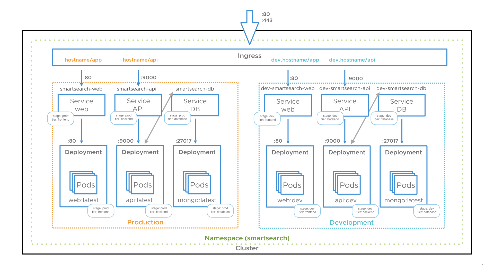

# SmartSearch

3-tier app for POC for Kubernetes




## Requirement

### CNI / Networking

This application needs to have contour as a CNI. You can deploy yourself contour or use my preconfigured file with:

`kubectl apply  -f plugins/`

Then you just need to deploy the global ingress to expose the app. By default the hostname is localhost but feel free to change.

`kubectl apply  -f ingress.yaml`

### Storage (not mandatory)

This application contains a mongo database. You can deploy it with persistent volumes bind to a specific volume.
For this you will need to generate persistent volumes and bind it to the DB deployment with volume claims.

⚠️ **Be sure that the folders already exist on your hosts** ⚠️

``` yaml
# persistent-volumes.yaml
apiVersion: v1
kind: Namespace
metadata:
  name: smartsearch
---
apiVersion: v1
kind: PersistentVolume
metadata:
  namespace: smartsearch
  labels:
    app: smartSearch
    stage: production
    folder: db
  name: mongo-db
spec:
  accessModes:
    - ReadWriteMany
  capacity:
    storage: 1Gi
  hostPath:
    path: yourOwnPath # Ex: /data/kubernetes/smartsearch/mongo/db
  storageClassName: fast
```

Then apply it on your cluster before deploying the app: `kubectl apply -f persistent-volumes.yaml`

```console ➜  smartSearch git:(master) kubectl get persistentvolume --namespace smartsearch    
NAME       CAPACITY   ACCESS MODES   RECLAIM POLICY   STATUS      CLAIM   STORAGECLASS   REASON   AGE
mongo-db   1Gi        RWX            Retain           Available           fast                    20s 
```

You now have a persistent volume ready to be claimed by the mongoDB pod

## Deployment

`kubectl apply -f smartsearch-app/`

## Help and debug

If you need visibility of what you have set up, you can use octant to have a better overview of all resources.

[](https://github.com/vmware-tanzu/octant)

[Github Repository](https://github.com/vmware-tanzu/octant)
